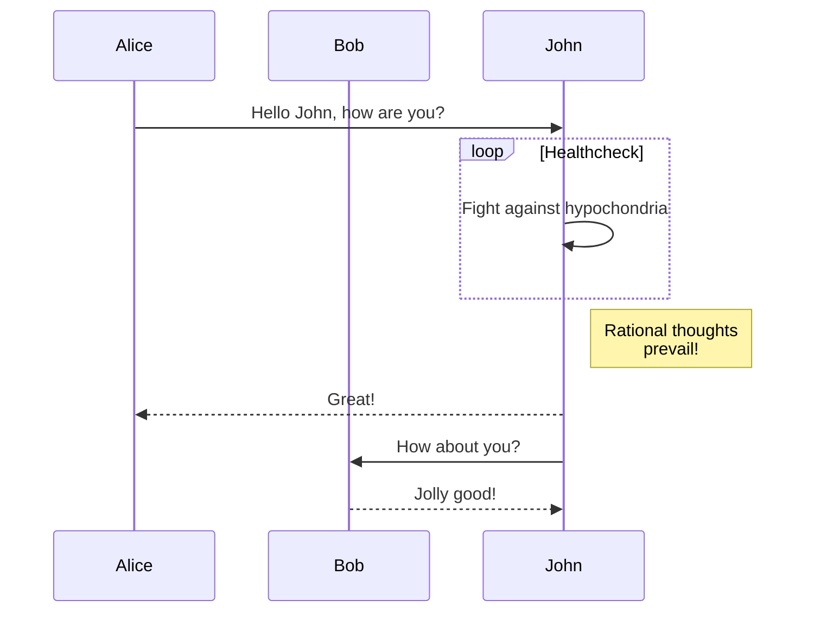

### Mermaid Support



### Footnotes
Here's a sentence with a footnote.[^1]

[^1]: This is unnamed footnote.

### Code Snippets 
Code taken from VPP's repository to test code snippets with highlighting:

```c {linenos=inline,hl_lines=[2, "6-9"],linenostart=19}
static clib_error_t *
af_packet_eth_set_max_frame_size (vnet_main_t *vnm, vnet_hw_interface_t *hi,
				  u32 frame_size)
{
  clib_error_t *error, *rv;
  af_packet_main_t *apm = &af_packet_main;
  af_packet_if_t *apif = pool_elt_at_index (apm->interfaces, hi->dev_instance);

  error = vnet_netlink_set_link_mtu (apif->host_if_index,
				     frame_size + hi->frame_overhead);

  if (error)
    {
      vlib_log_err (apm->log_class, "netlink failed to change MTU: %U",
		    format_clib_error, error);
      rv = vnet_error (VNET_ERR_SYSCALL_ERROR_1, "netlink error: %U",
		       format_clib_error, error);
      clib_error_free (error);
      return rv;
    }
  else
    apif->host_mtu = frame_size + hi->frame_overhead;
  return 0;
}
```
### Maths with Katex
$$
\begin{align}
\sqrt{37} & = \sqrt{\frac{73^2-1}{12^2}} \\\
 & = \sqrt{\frac{73^2}{12^2}\cdot\frac{73^2-1}{73^2}} \\\
 & = \frac{73}{12}\sqrt{1 - \frac{1}{73^2}} \\\
 & \approx \frac{73}{12}\left(1 - \frac{1}{2\cdot73^2}\right)
\end{align}
$$

### Columns Support

{}

##### Title 1

Lorem Ipsum is simply dummy text of the printing and typesetting industry.
Lorem Ipsum has been the industry's standard dummy text ever since the 1500s.

<--->

##### Title 2

Lorem Ipsum is simply dummy text of the printing and typesetting industry.
Lorem Ipsum has been the industry's standard dummy text ever since the 1500s

<--->

##### Title 3

Lorem Ipsum is simply dummy text of the printing and typesetting industry.
Lorem Ipsum has been the industry's standard dummy text ever since the 1500s

{}


### Information Boxes


**This is a bold line**

Hello there, and have a nice day



Hello there, and have a nice day



Hello there, and have a nice day



Hello there, and have a nice day


### Tabs



This is tab **MacOS** content.





This is tab **Linux** content.





This is tab **Windows** content.




### Collapsible

<details>
  <summary>Collapsible</summary>
    Hello there! This is an example collapsible.
</details>
