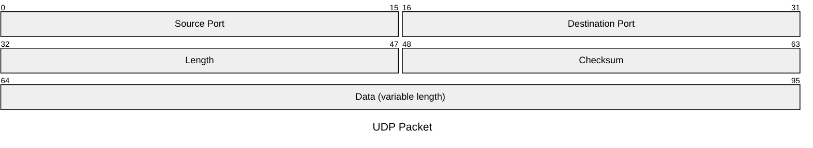
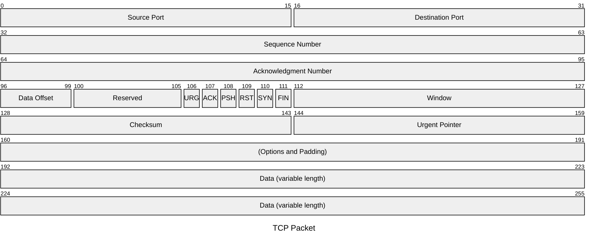

## L2

## L3

## L4
### UDP

```mermaid
---
title: "UDP Packet"
---
packet-beta
title UDP Packet
0-15: "Source Port"
16-31: "Destination Port"
32-47: "Length"
48-63: "Checksum"
64-95: "Data (variable length)"
```
### TCP

```mermaid
---
title: "TCP Packet"
---
packet-beta
0-15: "Source Port"
16-31: "Destination Port"
32-63: "Sequence Number"
64-95: "Acknowledgment Number"
96-99: "Data Offset"
100-105: "Reserved"
106: "URG"
107: "ACK"
108: "PSH"
109: "RST"
110: "SYN"
111: "FIN"
112-127: "Window"
128-143: "Checksum"
144-159: "Urgent Pointer"
160-191: "(Options and Padding)"
192-255: "Data (variable length)"
```

Todo: Ethernet - IPv4/v6 - ICMPv4/v6 - list RFCs - IPsec ESP tunnel Mode - IPSec Transport Mode - IKEv2 - PDU - Geneve - Vlan - VXLAN - SSL/TLS - HTTPs
