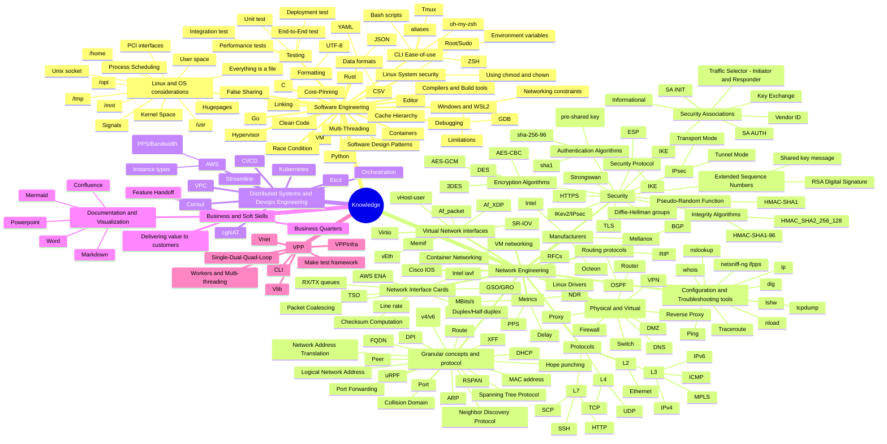

```mermaid
mindmap
  root((Knowledge))
    Software Engineering
        Go
        C
        Python
        Rust
        Software Design Patterns
        Clean Code
        VM
        Containers
        Hypervisor
        Linking
        Compilers and Build tools
        Core-Pinning
        Multi-Threading
        Cache Hierarchy
        False Sharing
        Race Condition
        Formatting
            UTF-8
        Data formats
            JSON
            CSV
            YAML
        Windows and WSL2
            Networking constraints
            Limitations
        Linux and OS considerations
            Signals
            Process Scheduling
            Unix socket
            User space
            Kernel Space
            Hugepages
            PCI interfaces
            Everything is a file
            /opt
            /usr
            /tmp
            /home
            /mnt
        Linux System security
            Root/Sudo
            Using chmod and chown
        Debugging
            GDB
        CLI Ease-of-use
            ZSH
            oh-my-zsh
            aliases
            Environment variables
            Bash scripts
            Tmux
        Editor
        Testing
            Unit test
            Integration test
            Deployment test
            End-to-End test
            Performance tests
    Network Engineering
        RFCs
        Cisco IOS
        Configuration and Troubleshooting tools
            ip
            Ping
            Traceroute
            nslookup
            dig
            whois
            lshw
            tcpdump
            nload
            netsniff-ng ifpps
        Security
            Strongswan
            IPsec
                Tunnel Mode
                Transport Mode
            IKE
                Security Associations
                    SA INIT
                    SA AUTH
                    Informational
                    Key Exchange
                    Vendor ID
                    Traffic Selector - Initiator and Responder
            Encryption Algorithms
                DES
                3DES
                AES-CBC
                AES-GCM
            Authentication Algorithms
                PSK (pre-shared key)
                sha1
                sha-256-96 
            Pseudo-Random Function
                HMAC-SHA1
            Integrity Algorithms
                HMAC-SHA1-96
                HMAC_SHA2_256_128
            Diffie-Hellman groups
            Extended Sequence Numbers
                RSA Digital Signature
                Shared key message
            Security Protocol
                IKE
                ESP
            IKev2/IPsec
            TLS
            HTTPS
        Protocols
            L2
                Ethernet
            L3
                IPv4
                IPv6
                MPLS
                ICMP
            L4
                UDP
                TCP
            L7
                HTTP
                SSH
                SCP
        Routing protocols
          BGP
          OSPF
          RIP
        Granular concepts and protocol
            FQDN
            XFF
            uRPF
            ARP
            Route
            Peer
            Collision Domain
            Logical Network Address
            MAC address
            Port
            DPI
            RSPAN
            Spanning Tree Protocol
            DHCP
            Neighbor Discovery Protocol
            IP addresses families (v4/v6)
            Port Forwarding
            Hope punching
            Network Address Translation
        Appliances (Physical and Virtual)
            Switch
            Router
            Proxy
            Reverse Proxy
            DNS
            VPN
            DMZ
            Firewall
        Metrics
            PPS
            MBits/s
            Delay
            NDR
        Network Interface Cards
            RX/TX queues
            GSO/GRO
            Intel iavf
            AWS ENA
            TSO
            Packet Coalescing
            Checksum Computation
            Line rate
            Duplex/Half-duplex
        Manufacturers
            Intel
            Mellanox
            Octeon
        VM networking
        Container Networking
        Virtual Network interfaces
            vEth
            Virtio
            SR-IOV
            vHost-user
            Af_packet
            Af_XDP
            Memif
        Linux Drivers
    Distributed Systems and Devops Engineering
        AWS
            Instance types
            Limitations (PPS/Bandwidth)
        Streamline
        Orchestration
        CI/CD
        Etcd
        Consul
        Kubernetes
        VPC
        cgNAT
    Business and Soft Skills
        Documentation and Visualization
            Markdown
            Confluence
            Mermaid
            Word
            Powerpoint
        Business Quarters
        Delivering value to customers
        Feature Handoff
    VPP
        CLI
        Single-Dual-Quad-Loop
        Workers and Multi-threading
        VPPInfra
        Vlib
        Vnet
        Make test framework
```

Network Engineering Performance testing: https://datatracker.ietf.org/doc/html/rfc2544
